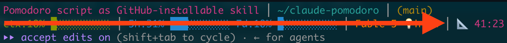

# claude-pomodoro

```
██████╗  ██████╗ ███╗   ███╗ ██████╗ ██████╗  ██████╗ ██████╗  ██████╗
██╔══██╗██╔═══██╗████╗ ████║██╔═══██╗██╔══██╗██╔═══██╗██╔══██╗██╔═══██╗
██████╔╝██║   ██║██╔████╔██║██║   ██║██║  ██║██║   ██║██████╔╝██║   ██║
██╔═══╝ ██║   ██║██║╚██╔╝██║██║   ██║██║  ██║██║   ██║██╔══██╗██║   ██║
██║     ╚██████╔╝██║ ╚═╝ ██║╚██████╔╝██████╔╝╚██████╔╝██║  ██║╚██████╔╝
╚═╝      ╚═════╝ ╚═╝     ╚═╝ ╚═════╝ ╚═════╝  ╚═════╝ ╚═╝  ╚═╝ ╚═════╝

                ████████╗██╗███╗   ███╗███████╗██████╗
▄▄▄▄▄▄▄▄▄▄▄▄▄▄▄ ╚══██╔══╝██║████╗ ████║██╔════╝██╔══██╗ ▄▄▄▄▄▄▄▄▄▄▄▄▄▄▄
▄▄▄▄▄▄▄▄▄▄▄▄▄▄▄    ██║   ██║██╔████╔██║█████╗  ██████╔╝ ▄▄▄▄▄▄▄▄▄▄▄▄▄▄▄
▄▄▄▄▄▄▄▄▄▄▄▄▄▄▄    ██║   ██║██║╚██╔╝██║██╔══╝  ██╔══██╗ ▄▄▄▄▄▄▄▄▄▄▄▄▄▄▄
▄▄▄▄▄▄▄▄▄▄▄▄▄▄▄    ██║   ██║██║ ╚═╝ ██║███████╗██║  ██║ ▄▄▄▄▄▄▄▄▄▄▄▄▄▄▄
                   ╚═╝   ╚═╝╚═╝     ╚═╝╚══════╝╚═╝  ╚═╝

                                   ★
                            for Claude Code
```

A Pomodoro timer that lives in the Claude Code status line. 50 minutes of work, 10 minutes of break, on repeat.



- `/pomodoro start|pause|reset|stop|setup` slash command inside Claude Code
- Timer segment for your status line: `🔨 12:34` during work (magenta), `🍺 52:01` during break (yellow)
- A different emoji every phase, picked from a pool of 64 per phase
- Desktop notification with sound on every work/break transition (macOS and Linux)
- Plain bash, no dependencies, state in one small text file

## Install

As a Claude Code plugin:

```
/plugin marketplace add TLausZ/claude-pomodoro
/plugin install pomodoro@claude-pomodoro
```

Or manually: clone the repo and put `scripts/pomodoro` on your `PATH` (the slash command then needs the path in `commands/pomodoro.md` adjusted, or just call the CLI directly).

## Status line

The timer display is a separate script, `scripts/pomodoro-segment`, so it plugs into whatever status line you already have. It prints one ANSI-colored segment (or nothing while the timer is stopped). Add it to your status line script (`~/.claude/statusline-command.sh` or wherever yours lives):

```bash
pomo=$("$HOME/path/to/claude-pomodoro/scripts/pomodoro-segment")
[ -n "$pomo" ] && line="$line ┃ $pomo"
```

Adjust the path to wherever the plugin or clone ended up on your machine.

No status line yet? A minimal one that shows only the timer:

```bash
#!/usr/bin/env bash
cat > /dev/null   # discard the JSON Claude Code pipes in
"$HOME/path/to/claude-pomodoro/scripts/pomodoro-segment"
```

Save it, make it executable, and point `statusLine.command` in `~/.claude/settings.json` at it.

The phase-change notification fires from this segment script as a side effect of the status line refresh, so it costs no tokens and needs no background process.

## Usage

In Claude Code:

```
/pomodoro start              # start, or resume from pause
/pomodoro pause              # freeze the clock
/pomodoro reset              # restart the work phase at 00:00
/pomodoro stop               # stop and hide the timer
/pomodoro setup 25:00 05:00  # set work and break length (mm:ss)
```

The same actions work from any shell via the CLI: `pomodoro -start`, `-pause`, `-reset`, `-stop`, `-setup 25:00 05:00`.

## Customizing

`/pomodoro setup <work> <break>` sets the phase lengths in `mm:ss` and stores them in `~/.claude/pomodoro-config`. Without that file the defaults apply: 50 minutes work, 10 minutes break. Notification texts and sounds live in `scripts/pomodoro-segment`.

## How it works

State is a one-line file, `~/.claude/pomodoro-state`: `running <start-epoch>` or `paused <elapsed-seconds>`; no file means stopped. Phase lengths come from `~/.claude/pomodoro-config` (`work_sec break_sec`), falling back to 50/10 minutes. The segment script derives elapsed time, phase, and clock from it on every status line refresh. The per-phase emoji is a deterministic hash of the phase number, so it stays put during a phase and re-rolls on each transition. `~/.claude/pomodoro-lastphase` remembers the last phase so a notification fires exactly once per transition.

## Platform notes

- macOS: notifications via `osascript`, with sound.
- Linux: notifications via `notify-send`, if installed.
- Windows (Git Bash): timer and colors work, notifications are silently skipped.
